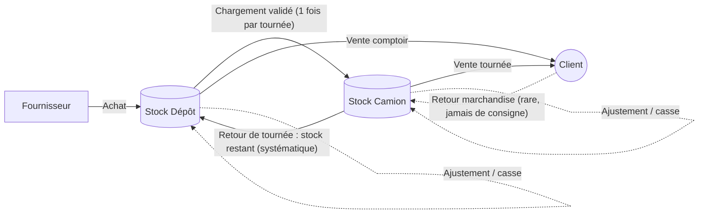
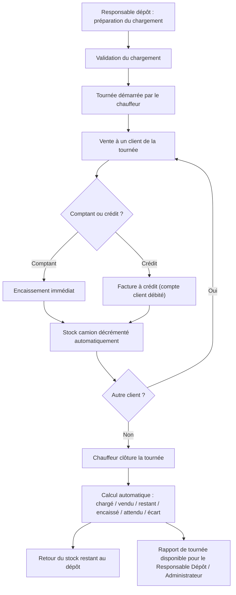
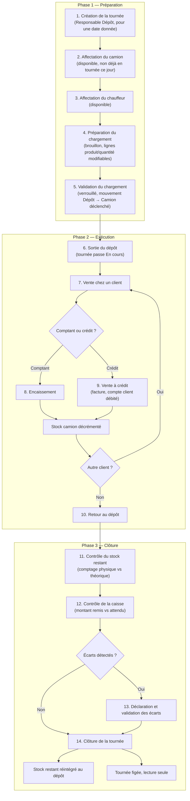
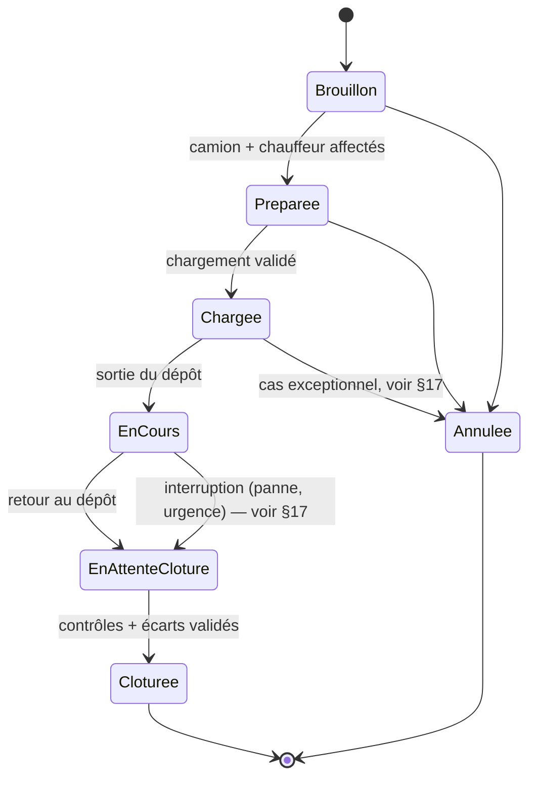
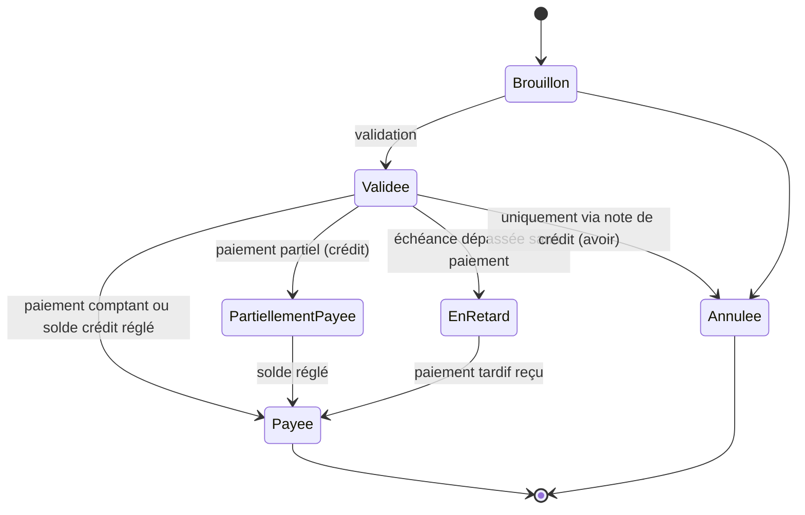
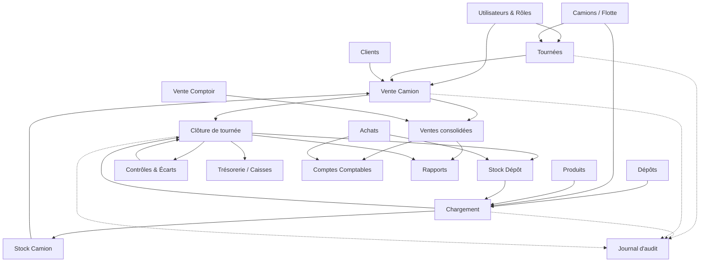

# Architecture fonctionnelle — COMDIS

> Document de référence officiel de COMDIS. Aucun code, aucune API, aucune base de données réelle à ce stade — uniquement la définition complète du fonctionnement métier cible, destinée à cadrer tous les développements futurs.

## 0. Résumé exécutif

COMDIS n'est pas un ERP de distribution générique : c'est un ERP de **vente ambulante (Van Sales / Direct Store Delivery)**, un modèle métier bien connu chez les distributeurs de boissons dans le monde (embouteilleurs Coca-Cola, brasseries, eaux minérales). Ce modèle a un point commun structurant : **le camion est un stock à part entière**, pas un simple moyen de transport.

Toute l'architecture qui suit découle de cette idée centrale : le stock n'est plus une quantité unique par produit, mais une quantité **par produit ET par emplacement** (dépôt ou camion). C'est le changement le plus important par rapport à ce qui a été construit jusqu'ici (le module Produits actuel a un seul champ `quantiteStock` global, qui devra évoluer).

Comparables du marché sur ce modèle précis : **SAP Business One (Route Accounting / DSD)** est la référence la plus proche fonctionnellement ; **Odoo** couvre les briques (Inventory multi-emplacement, POS, Fleet) mais sans module « van sales » natif — il faudrait les assembler, ce qui est en réalité proche de ce que fait COMDIS en étant construit sur mesure. Sage et Dolibarr sont moins adaptés nativement à ce modèle (voir §21).

---

## 1. Le modèle métier en une phrase

> Le dépôt est la source de vérité du stock global. Chaque camion est un stock secondaire, totalement indépendant du dépôt, alimenté par un chargement unique en début de tournée, vidé par les ventes du chauffeur, et réconcilié à la fin de chaque journée.

Trois notions doivent exister dès la conception du modèle de données, même si elles ne sont pas codées aujourd'hui :

| Notion | Rôle |
|---|---|
| **Emplacement de stock** (`Emplacement`) | Abstraction commune au Dépôt et au Camion. Le stock d'un produit se lit toujours "à un emplacement donné", jamais dans l'absolu. |
| **Mouvement de stock** (`MouvementStock`) | Enregistrement immuable de chaque déplacement de quantité (achat, transfert, vente, retour, ajustement). Le stock affiché à l'instant T est la somme des mouvements, pas un compteur qu'on modifie directement — voir le risque détaillé au §19. |
| **Tournée** (`Tournee`) | Le fil rouge qui relie un camion, un chauffeur, une date, un chargement unique, une liste de ventes et une clôture. |

---

## 2. Périmètre exclu

Pour éviter toute ambiguïté future, ce qui suit est **explicitement hors périmètre** de COMDIS aujourd'hui. Un développeur ne doit ni le coder, ni le prévoir "au cas où" dans le modèle de données tant que ce périmètre n'est pas révisé.

| Exclusion | Détail |
|---|---|
| **Gestion des consignes** | Aucune gestion des bouteilles consignées, des casiers consignés ou des emballages consignés. Ce n'est pas "pas encore fait" — c'est hors périmètre fonctionnel. Les retours de marchandise (§17) ne concernent jamais la consigne. |
| **Multi-dépôts** | L'entreprise possède **un seul dépôt principal** aujourd'hui. Le modèle de données doit rester capable d'en accueillir plusieurs (§20), mais aucune fonctionnalité multi-dépôt n'est à construire maintenant. |
| **Multi-sociétés** | Une seule société aujourd'hui. Voir §20 pour la façon d'y préparer le modèle sans le construire. |
| **Rechargement en cours de tournée** | Un camion ne peut jamais être rechargé pendant sa tournée (règle métier §12). Le "transfert inter-camions en cours de journée" évoqué dans une version antérieure de ce document n'est **pas** une fonctionnalité du périmètre actuel. |

---

## 3. Liste complète des modules

| # | Module | Statut | Description |
|---|---|---|---|
| 1 | **Authentification & Utilisateurs** | À construire | Comptes, rôles, rattachement (dépôt ou camion). |
| 2 | **Rôles & Permissions** | À construire | Matrice de droits par module (§4). |
| 3 | **Produits & Catalogue** | ✅ Existant (à faire évoluer) | Référentiel produits — le champ stock devra devenir multi-emplacement. |
| 4 | **Catégories / Marques / Fournisseurs** | Partiel (stubs) | Référentiels de classification, aujourd'hui dérivés des mock data produits. |
| 5 | **Dépôts** | À construire | Registre du dépôt (un seul aujourd'hui, structure extensible — §2). |
| 6 | **Camions / Flotte** | À construire | Registre des camions : immatriculation, capacité, dépôt de rattachement, chauffeur par défaut. |
| 7 | **Stock multi-emplacement** | À construire (refonte) | Vue du stock par produit × emplacement (dépôt ou camion). |
| 8 | **Chargement de camion** | À construire | Préparation + validation d'un transfert Dépôt → Camion, unique par tournée. |
| 9 | **Tournées** | À construire | Cycle complet d'une journée camion (§7). |
| 10 | **Vente Camion (POS mobile / Van Sales)** | À adapter depuis le POS existant | Vente scoping au camion du chauffeur connecté uniquement. |
| 11 | **Vente Comptoir (Dépôt)** | ✅ Existant (POS actuel) | Vente directe au dépôt, gérée par le caissier dépôt. |
| 12 | **Clôture de tournée** | À construire | Réconciliation automatique fin de tournée (§7). |
| 13 | **Clients** | Stub existant | Fiche client, historique, plafond de crédit (lié au mode "Crédit Client" du POS). |
| 14 | **Ventes (consolidé)** | Stub existant | Historique global, toutes origines confondues (comptoir + camions). |
| 15 | **Achats** | Stub existant | Réapprovisionnement du dépôt depuis les fournisseurs. |
| 16 | **Comptes Comptables** | ✅ Existant | Plan Comptable Marocain. |
| 17 | **Écritures comptables** | Futur | Génération automatique d'écritures depuis Ventes/Achats. |
| 18 | **Trésorerie / Caisses** | À construire | Caisse dépôt + caisse par camion (espèces en possession du chauffeur). |
| 19 | **Rapports & Analytics** | Stub existant | KPIs par rôle : tournées, écarts, ventes par chauffeur/produit/client. |
| 20 | **Contrôles & Écarts** | À construire | Moteur transverse de contrôles automatiques et de gestion des anomalies (§13, §14). |
| 21 | **Journal d'audit** | À construire | Historisation de toute opération sensible (§15). |
| 22 | **Paramètres** | Stub existant | Configuration générale (TVA, unités, numérotation...). |

---

## 4. Rôles utilisateurs & matrice de permissions

Quatre rôles demandés. Niveaux : **Aucun** · **Lecture** · **Lecture/Écriture** · **Total**.

| Module / Écran | Administrateur | Responsable Dépôt | Caissier Dépôt | Chauffeur |
|---|---|---|---|---|
| Dashboard | Total (global) | Lecture (son dépôt) | Lecture (son dépôt) | Lecture (**sa tournée uniquement**, vue simplifiée) |
| Produits / Catalogue | Total | Lecture/Écriture (stock) | Lecture | Lecture (produits présents **sur son camion**) |
| Stock Dépôt | Total | Total | Lecture | **Aucun** |
| Stock Camions (tous) | Total | Lecture (tous camions de son dépôt) | Aucun | Lecture/Écriture (**son camion uniquement**) |
| Chargement de camion | Total | Total | Aucun | Lecture (son chargement, non modifiable) |
| Camions / Flotte | Total | Lecture | Aucun | Aucun |
| Tournées | Total | Total (planification) | Aucun | Lecture/Écriture (démarrer/clôturer **la sienne**) |
| Vente Camion (POS mobile) | Lecture (globale) | Lecture (globale) | Aucun | Total (sa tournée) |
| Vente Comptoir | Lecture | Lecture | Total | Aucun |
| Clôture de tournée | Total | Total (validation) | Aucun | Lecture/Écriture (déclenche la sienne) |
| Clients | Total | Lecture/Écriture | Lecture | Lecture (clients de sa tournée) |
| Achats | Total | Total | Aucun | Aucun |
| Comptes Comptables | Total | **Aucun** | **Aucun** | **Aucun** |
| Trésorerie / Caisses | Total | Lecture (caisse dépôt) | Total (sa caisse) | Lecture/Écriture (sa caisse camion) |
| Écarts (déclaration/validation) | Total (validation) | Total (validation) | Déclaration (sa caisse) | Déclaration (sa tournée) |
| Journal d'audit | Total | Lecture (périmètre dépôt) | Aucun | Aucun |
| Rapports | Total | Lecture (périmètre dépôt) | Lecture (limité) | Lecture (sa tournée uniquement) |
| Utilisateurs & Rôles | Total | Aucun | Aucun | Aucun |
| Paramètres | Total | **Aucun** | **Aucun** | **Aucun** |

**Point de vigilance explicite** (rappel de la contrainte donnée) : le chauffeur ne doit jamais voir un autre camion, le stock dépôt, la comptabilité ou les paramètres. Cette matrice le garantit sur le papier — voir §19 pour le risque d'implémentation (le filtrage doit se faire côté données, pas seulement côté UI) et §16 pour les protections associées.

---

## 5. Flux de stock

Deux flux de "retour" bien distincts, à ne pas confondre :

| Flux | Fréquence | Nature |
|---|---|---|
| **Retour de tournée** (stock restant → dépôt) | Systématique, à chaque clôture | Simple restitution comptable du stock invendu, pas une anomalie |
| **Retour marchandise** (client → camion) | Rare, exceptionnel | Litige ou erreur de livraison — jamais lié à la consigne (§2) |

### Types de mouvements de stock à prévoir

| Type de mouvement | Emplacement source | Emplacement destination | Déclenché par |
|---|---|---|---|
| Entrée achat | Fournisseur (externe) | Dépôt | Module Achats |
| Transfert chargement | Dépôt | Camion | Module Chargement, après validation — **unique par tournée** |
| Sortie vente camion | Camion | Client (externe) | Vente Camion |
| Sortie vente comptoir | Dépôt | Client (externe) | Vente Comptoir |
| Retour de tournée | Camion | Dépôt | Clôture de tournée |
| Retour marchandise | Client (externe) | Camion ou Dépôt | Module Retours (exceptionnel) |
| Ajustement d'inventaire | Dépôt ou Camion | — | Comptage physique, écart constaté |

Le retour de tournée reste **la pièce la plus critique** du modèle : sans lui, le "stock restant" en fin de tournée resterait affiché mais jamais physiquement remis au dépôt, ce qui fausserait le stock dépôt dès le lendemain.

---

## 6. Flux de vente (vue d'ensemble)

Le détail complet, étape par étape, est donné au §7.

---

## 7. Cycle métier complet d'une tournée

Ce cycle est **le cœur fonctionnel de COMDIS**. Toutes les règles (§12), tous les contrôles (§13) et toute la gestion des écarts (§14) s'articulent autour de lui.

### Détail de chaque étape

| # | Étape | Acteur | Effet |
|---|---|---|---|
| 1 | Création de la tournée | Responsable Dépôt | Crée l'enregistrement `Tournee` en statut `Brouillon`, pour une date donnée |
| 2 | Affectation du camion | Responsable Dépôt | Un camion disponible est lié à la tournée — un camion ne peut être affecté qu'à **une seule tournée par jour** |
| 3 | Affectation du chauffeur | Responsable Dépôt | Un chauffeur disponible est lié à la tournée → statut `Préparée` |
| 4 | Préparation du chargement | Responsable Dépôt | Sélection des produits et quantités à charger, encore modifiable (statut `Brouillon` du Chargement) |
| 5 | Validation du chargement | Responsable Dépôt | Le chargement devient définitif ; le mouvement de stock Dépôt → Camion est créé ; **aucune nouvelle validation de chargement n'est possible pour cette tournée** → statut `Chargée` |
| 6 | Sortie du dépôt | Chauffeur | La tournée passe `En cours` ; le chauffeur peut commencer à vendre |
| 7 | Vente chez un client | Chauffeur | Création d'une vente rattachée à la tournée et au client |
| 8 | Encaissement (comptant) | Chauffeur | Espèces, chèque, carte ou virement, encaissé immédiatement |
| 9 | Vente à crédit | Chauffeur | Facture créée, aucun encaissement immédiat, solde client débité (sous réserve du plafond de crédit — §13) |
| 10 | Retour au dépôt | Chauffeur | Fin de journée, la tournée passe `En attente de clôture` |
| 11 | Contrôle du stock restant | Chauffeur + Responsable Dépôt | Comptage physique du camion, comparé au stock théorique (chargé − vendu) |
| 12 | Contrôle de la caisse | Chauffeur + Responsable Dépôt | Montant physique remis, comparé au montant attendu (somme des encaissements comptant) |
| 13 | Déclaration et validation des écarts | Chauffeur (déclare) / Responsable Dépôt ou Administrateur (valide) | Tout écart doit être qualifié et validé avant la suite (§14) |
| 14 | Clôture de la tournée | Responsable Dépôt ou Administrateur | Statut final `Clôturée` ; le stock restant est réintégré au dépôt (mouvement de retour) ; la tournée devient historique et non modifiable |

---

## 8. Cycle de vie des principaux documents

### Tournée

| État | Signification |
|---|---|
| `Brouillon` | Tournée créée, camion et/ou chauffeur pas encore confirmés |
| `Préparée` | Camion + chauffeur affectés, chargement pas encore validé |
| `Chargée` | Chargement validé, stock transféré, camion pas encore sorti |
| `En cours` | Camion sorti du dépôt, ventes possibles |
| `En attente de clôture` | Camion rentré, contrôles stock/caisse en cours |
| `Clôturée` | Définitive, lecture seule |
| `Annulée` | Abandonnée avant sortie (au-delà, voir cas particuliers §17) |

### Facture

| État | Signification |
|---|---|
| `Brouillon` | Lignes encore modifiables, pas encore opposable |
| `Validée` | Définitive, décrémente le stock, non modifiable |
| `Partiellement payée` | Vente à crédit, règlement partiel reçu |
| `Payée` | Soldée intégralement |
| `En retard` | Échéance de crédit dépassée sans règlement complet |
| `Annulée` | Uniquement via une note de crédit référençant la facture d'origine — **jamais par suppression** |

### Paiement

| État | Signification |
|---|---|
| `En attente` | Ex. chèque remis mais non encore encaissé |
| `Validé` | Fonds confirmés reçus |
| `Rejeté` | Chèque impayé, carte refusée |
| `Annulé` | Annulation avant validation uniquement |

### Chargement

| État | Signification |
|---|---|
| `Brouillon` | Lignes produit/quantité modifiables |
| `Validé` | Verrouillé, mouvement de stock déclenché — **non modifiable** (règle §12) |
| `Annulé` | Uniquement possible avant validation |

### Mouvement de stock

Les mouvements sont **immuables par principe** (§1) : on ne "modifie" jamais un mouvement, on le **contre-passe**.

| État | Signification |
|---|---|
| `Validé` | Mouvement comptabilisé, impacte le stock réel |
| `Annulé (contre-passé)` | Neutralisé par un mouvement inverse explicite, jamais par suppression ou édition — garantit la traçabilité (§15) |

---

## 9. Relations entre les modules

Lecture du schéma : **Chargement** et **Tournée** sont les deux modules pivots — presque tout le reste en dépend directement ou indirectement. Le **Journal d'audit** (liens pointillés) observe transversalement les opérations sensibles sans être un module métier à proprement parler. C'est pourquoi Chargement/Tournées apparaissent tôt dans l'ordre de développement recommandé (§18).

---

## 10. Écrans nécessaires

| Module | Écrans |
|---|---|
| Utilisateurs & Rôles | Liste utilisateurs · Fiche utilisateur (rôle, dépôt/camion de rattachement) · Matrice de permissions (lecture seule ou éditable selon phase) |
| Dépôts | Fiche dépôt (registre à un seul élément aujourd'hui, écran prêt pour plusieurs) |
| Camions / Flotte | Liste des camions · Fiche camion (capacité, chauffeur par défaut, dépôt de rattachement) |
| Stock multi-emplacement | Vue stock filtrable par emplacement (Dépôt / Camion X) · Historique des mouvements d'un produit |
| Chargement de camion | Formulaire de préparation (sélection camion + lignes produit/quantité) · Écran de validation (aperçu avant/après stock) |
| Tournées | Planning des tournées (calendrier ou liste) · Détail d'une tournée (chargement lié, ventes en cours, statut) |
| Vente Camion (chauffeur) | Écran simplifié "mon camion" : recherche produit, panier, encaissement — **UX radicalement allégée**, pensée tactile/terrain, pas une simple version responsive de l'écran admin |
| Clôture de tournée | Écran récapitulatif : chargé / vendu / restant / encaissé / attendu / écart, avec confirmation de retour de stock |
| Contrôles & Écarts | Liste des écarts déclarés (filtrable par statut) · Formulaire de déclaration · Écran de validation hiérarchique |
| Journal d'audit | Liste consultable (filtrable par utilisateur, entité, période) — lecture seule, aucune action de modification |
| Clients | Liste clients · Fiche client (historique, solde, plafond crédit) |
| Ventes (consolidé) | Liste globale filtrable par origine (comptoir/camion), par chauffeur, par période |
| Achats | Liste des commandes fournisseurs · Formulaire de commande · Réception (entrée en stock dépôt) |
| Trésorerie / Caisses | Caisse dépôt (mouvements du jour) · Caisse camion (espèces en possession du chauffeur, rapprochée à la clôture) |
| Rapports | Rapport de tournée · Écarts consolidés · Ventes par produit/chauffeur/client · Valorisation du stock |
| Paramètres | TVA, unités, numérotation des documents, dépôt/rôle par défaut |

---

## 11. Tables métier futures (modèle conceptuel)

Pas de schéma SQL — juste les entités, leur rôle et leurs relations, pour cadrer le futur backend.

| Entité | Rôle | Champs clés (indicatif) | Relations principales |
|---|---|---|---|
| `Utilisateur` | Compte applicatif | nom, email, rôle, dépôt/camion de rattachement | 1–N `Tournee` (en tant que chauffeur) |
| `Role` | Rôle métier | libellé (Admin, RespDépôt, Caissier, Chauffeur) | 1–N `Utilisateur` |
| `Depot` | Emplacement fixe | nom, adresse | 1–N `Camion`, 1–N `StockNiveau` |
| `Camion` | Emplacement mobile | immatriculation, capacité, dépôt de rattachement | 1–N `Tournee`, 1–N `StockNiveau` |
| `Emplacement` *(abstraction)* | Unifie Dépôt/Camion pour le stock | type (DEPOT/CAMION), référence | 1–N `StockNiveau`, 1–N `MouvementStock` |
| `Produit` | Référentiel produit (existant) | référence, désignation, prix, TVA | N–1 Catégorie/Marque/Fournisseur |
| `StockNiveau` | Quantité d'un produit à un emplacement donné | produit, emplacement, quantité | N–1 `Produit`, N–1 `Emplacement` |
| `MouvementStock` | Trace immuable de chaque mouvement | type, produit, quantité, emplacement source, emplacement destination, date, référence document, statut | N–1 `Produit`, lié à `Chargement`/`Vente`/`Achat`/`ClotureTournee` |
| `Chargement` | Préparation de tournée | camion, dépôt source, date, statut, responsable | 1–N `LigneChargement`, 1–1 `Tournee` |
| `LigneChargement` | Détail par produit | chargement, produit, quantité | N–1 `Chargement`, N–1 `Produit` |
| `Tournee` | Fil rouge d'une journée camion | camion, chauffeur, date, dépôt de départ, statut | 1–1 `Chargement`, 1–N `Vente`, 1–1 `ClotureTournee` |
| `Client` | Fiche client (existant en stub) | nom, type, plafond crédit, solde, statut (bloqué/actif) | 1–N `Vente` |
| `Vente` | Transaction de vente | tournée (nullable si comptoir), client, date, montant, mode règlement, statut | N–1 `Tournee`, N–1 `Client`, 1–N `LigneVente`, 0–1 `Facture` |
| `LigneVente` | Détail par produit vendu | vente, produit, quantité, prix, remise, TVA | N–1 `Vente`, N–1 `Produit` |
| `Facture` | Document opposable d'une vente | vente, statut, échéance (si crédit) | 1–1 `Vente`, 0–N `NoteCredit` |
| `NoteCredit` (avoir) | Seul moyen d'annuler/corriger une facture validée | facture d'origine, montant, motif, date | N–1 `Facture` |
| `Encaissement` | Paiement lié à une vente | vente, montant, mode, statut, référence (n° chèque, etc.) | N–1 `Vente` |
| `ClotureTournee` | Réconciliation fin de tournée | tournée, total chargé, total vendu, total retourné, montant attendu, montant encaissé, écart, statut | 1–1 `Tournee` |
| `Ecart` | Anomalie constatée (stock ou caisse) | type, quantité/montant, produit (optionnel), tournée d'origine, déclaré par, validé par, statut, justification | N–1 `Tournee`, N–1 `ClotureTournee` |
| `Achat` | Commande fournisseur | fournisseur, dépôt destination, date, statut | 1–N `LigneAchat` |
| `LigneAchat` | Détail par produit commandé | achat, produit, quantité, prix | N–1 `Achat`, N–1 `Produit` |
| `CompteComptable` | Plan comptable (existant) | numéro, nom, classe, type | Référencé par les écritures futures |
| `EcritureComptable` *(futur)* | Journal comptable | compte, débit, crédit, date, référence document | N–1 `CompteComptable` |
| `JournalAudit` | Historique des opérations sensibles | utilisateur, date, heure, type d'événement, entité, référence, ancienne valeur, nouvelle valeur, adresse IP | N–1 `Utilisateur`, référence libre vers toute entité |

---

## 12. Règles métier

### Tournée

- Une tournée appartient à un seul camion.
- Une tournée appartient à un seul chauffeur.
- Un camion ne peut effectuer qu'**une seule tournée par jour**.
- Une tournée ne peut avoir qu'**un seul chargement**.
- Le camion ne peut **jamais être rechargé** pendant une tournée en cours.
- Un camion ne peut pas avoir deux tournées ouvertes simultanément (voir §16).
- Une tournée ne peut pas être clôturée si les contrôles (stock + caisse) ne sont pas terminés.
- Une tournée clôturée devient définitive et non modifiable (lecture seule).

### Chargement

- Impossible de modifier un chargement après validation.
- Impossible de charger une quantité supérieure au stock disponible au dépôt.
- Un chargement validé déclenche immédiatement le mouvement de stock Dépôt → Camion.

### Stock

- Impossible de vendre un produit absent du camion (stock camion insuffisant).
- Le stock ne peut jamais devenir négatif (§13).
- Toute variation de stock passe obligatoirement par un mouvement de stock tracé — aucune modification directe d'une quantité.
- Le stock du camion est indépendant du stock du dépôt : aucune opération ne peut les confondre.

### Vente / Facture

- Une facture appartient à une seule tournée (sauf vente comptoir, rattachée au dépôt).
- Impossible de supprimer une facture validée — seule une note de crédit (avoir) peut l'annuler ou la corriger.
- Une vente à crédit ne peut être enregistrée que pour un client non bloqué et dans la limite de son plafond de crédit (§13).
- Le montant d'une facture doit correspondre exactement à la somme de ses lignes (contrôle de cohérence).

### Client / Crédit

- Un client bloqué ne peut faire l'objet d'aucune nouvelle vente à crédit.
- Le solde client ne peut jamais dépasser le plafond de crédit sans dérogation explicite et validée.

### Caisse

- La caisse d'un camion ne peut être rapprochée qu'après le retour au dépôt.
- Tout écart de caisse doit être justifié avant la clôture de la tournée.

### Retours

- Un retour de marchandise ne concerne **jamais** les bouteilles, casiers ou emballages consignés (hors périmètre — §2).
- Un retour doit toujours être rattaché à une vente ou une tournée d'origine.

### Utilisateurs / Accès

- Un chauffeur ne peut agir que sur son propre camion et sa propre tournée.
- Un rôle ne peut jamais s'auto-attribuer une permission supérieure à celle définie par l'administrateur.

---

## 13. Contrôles automatiques

| Contrôle | Déclenché quand | Action système |
|---|---|---|
| Stock théorique vs stock réel (camion) | Contrôle fin de tournée | Calcule l'écart, bloque la clôture tant qu'il n'est pas validé |
| Caisse attendue vs caisse remise | Contrôle fin de tournée | Calcule l'écart, bloque la clôture tant qu'il n'est pas validé |
| Stock négatif | Toute vente/sortie dépassant le stock disponible | Bloque l'opération |
| Dépassement du plafond de crédit | Création d'une vente à crédit | Bloque, ou demande une dérogation validée hiérarchiquement |
| Client bloqué | Création de toute vente pour ce client | Bloque l'opération |
| Facture en double | Validation d'une facture avec référence déjà existante | Bloque et alerte |
| Incohérence de chargement | Validation d'un chargement dont une ligne dépasse le stock dépôt disponible | Bloque la validation |
| Tournée non clôturée | Tentative de créer une nouvelle tournée pour un camion ayant une tournée non clôturée | Bloque la création |
| Double tournée ouverte | Tentative d'affecter un camion déjà en tournée active | Bloque l'affectation |
| Cohérence des lignes de facture | Validation d'une facture | Vérifie que le total correspond à la somme des lignes (HT, TVA, TTC) |

---

## 14. Gestion des écarts

Chaque anomalie constatée — stock ou caisse — doit être enregistrée comme un **événement structuré** (`Ecart`), jamais comme un simple nombre affiché à l'écran sans trace.

### Cycle de vie d'un écart

1. **Constat** : à la clôture de tournée (§7, étapes 11-12), le système calcule automatiquement un écart si stock réel ≠ stock théorique, ou caisse remise ≠ caisse attendue.
2. **Catégorisation** : le déclarant (généralement le chauffeur) qualifie l'écart selon un type.
3. **Justification** : un commentaire est obligatoire.
4. **Validation hiérarchique** : le Responsable Dépôt ou l'Administrateur approuve ou rejette.
5. **Impact** : une fois validé, l'écart déclenche un mouvement de stock d'ajustement et/ou, plus tard, une écriture comptable de perte.

### Types d'écarts à prévoir

| Type | Exemple | Concerne |
|---|---|---|
| Marchandise manquante | Produit chargé mais absent au comptage retour | Stock |
| Casse | Bouteille cassée pendant le transport | Stock |
| Perte | Vol, disparition inexpliquée | Stock |
| Erreur de chargement | Quantité chargée différente de celle prévue | Stock |
| Erreur de saisie | Quantité vendue mal enregistrée par le chauffeur | Stock ou Caisse |
| Erreur de caisse | Rendu de monnaie incorrect, billet mal compté | Caisse |

Un écart non validé **bloque la clôture de la tournée** (§12, §13) — c'est le mécanisme qui empêche qu'une anomalie soit simplement ignorée.

---

## 15. Journal d'audit

Principe : le journal d'audit est lui-même **immuable** — aucune entrée n'est jamais modifiable ni supprimable, y compris par un administrateur.

### Opérations à historiser

| Catégorie | Exemples |
|---|---|
| Connexion | Connexion, déconnexion, échec d'authentification |
| Création | Nouvelle tournée, nouveau client, nouveau produit |
| Modification | Édition d'une fiche client, changement de plafond de crédit |
| Suppression | Toute suppression (rare, en principe limitée aux brouillons) |
| Validation | Validation d'un chargement, d'une facture, d'une clôture |
| Chargement | Préparation, validation d'un chargement |
| Transfert | Tout mouvement de stock |
| Vente | Création d'une vente, comptant ou crédit |
| Paiement | Encaissement, rejet, annulation d'un paiement |
| Clôture | Clôture de tournée, validation d'écart |

### Champs enregistrés pour chaque événement

| Champ | Description |
|---|---|
| Utilisateur | Qui a réalisé l'action |
| Date | Jour de l'événement |
| Heure | Horodatage précis |
| Type d'événement | Catégorie (voir tableau ci-dessus) |
| Entité concernée | Type et identifiant de l'objet modifié |
| Ancienne valeur | État avant l'opération (si modification) |
| Nouvelle valeur | État après l'opération |
| Adresse IP | Si disponible |

---

## 16. Sécurité métier

- **Impossible de modifier une facture validée** — seule une note de crédit permet une correction (§8, §12).
- **Impossible de supprimer une écriture historique** : mouvement de stock, écriture comptable, entrée du journal d'audit (§8, §15).
- **Un chauffeur n'a accès qu'à son propre camion** : aucune requête ne doit permettre de consulter le stock d'un autre camion ou du dépôt. Le filtrage doit être appliqué **côté données**, pas seulement côté interface (rappel du risque §19).
- **Impossible d'avoir deux tournées ouvertes pour un même camion** simultanément (§12).
- Les actions de validation (chargement, facture, clôture) sont **toujours** horodatées et associées à un utilisateur identifié, sans exception.
- **Séparation des tâches recommandée** : la personne qui prépare un chargement peut être différente de celle qui le valide — à activer selon la taille de l'équipe, ce n'est pas une contrainte dure du modèle actuel.

---

## 17. Cas particuliers

| Cas | Traitement recommandé |
|---|---|
| **Panne du camion** | La tournée passe en statut exceptionnel (interruption, §8) ; le stock restant est comptabilisé en l'état ; un retour partiel peut être déclenché manuellement par le Responsable Dépôt |
| **Tournée interrompue** | Même traitement que la panne : contrôle du stock et de la caisse à l'instant de l'interruption, écarts déclarés normalement (§14) |
| **Changement de chauffeur en cours de tournée** | La tournée reste liée au camion et au chargement d'origine ; le changement est historisé (§15) mais ne crée pas une nouvelle tournée |
| **Erreur de chargement détectée après validation** | Le chargement validé n'est jamais modifié (règle §12) ; une correction est créée comme un écart distinct (§14) |
| **Erreur d'encaissement** | Un encaissement validé n'est pas supprimé ; il est contre-passé par un mouvement inverse, avec justification |
| **Retour exceptionnel** | Rattaché obligatoirement à la vente ou à la tournée d'origine ; ne concerne jamais la consigne (§2) |
| **Perte de marchandise** | Déclarée comme écart de type "Perte" (§14), validée hiérarchiquement, impacte le stock camion |
| **Annulation d'une facture** | Jamais par suppression ; toujours via une note de crédit référençant la facture d'origine (§8, §12) |
| **Client refusant la livraison** | La vente n'est pas créée ; le produit reste dans le stock du camion ; aucun mouvement de stock n'est déclenché |
| **Fermeture anticipée de la tournée** | Possible avant la fin de journée théorique, mais suit **exactement** le même cycle de contrôle (stock + caisse + écarts) qu'une clôture normale — aucun raccourci autorisé |

---

## 18. Ordre idéal de développement

L'ordre suit les dépendances du schéma §9 : les modules pivots (Utilisateurs/Rôles, Stock multi-emplacement, Chargement, Tournées) doivent exister avant que les modules qui en dépendent aient un sens.

| Phase | Contenu | Pourquoi à ce moment |
|---|---|---|
| **0 — Déjà fait** | Layout, Produits, Comptes Comptables, POS (mono-emplacement) | Socle UI et premiers modules autonomes |
| **1** | Utilisateurs & Rôles (mock) | Conditionne toute la visibilité par rôle des phases suivantes |
| **2** | Dépôt + Camions / Flotte (registres) | Prérequis pour parler d'"emplacement" |
| **3** | Refonte Stock : passage à un modèle multi-emplacement (`StockNiveau`) | Casse potentiellement le module Produits actuel — à faire consciemment, tôt |
| **4** | Chargement de camion | Premier flux qui exploite le stock multi-emplacement, avec la règle "un seul chargement par tournée" |
| **5** | Tournées (cycle complet §7, hors ventes) | Relie Chargement à la vente, formalise les statuts (§8) |
| **6** | Vente Camion (adapter le POS existant, vue "mon camion" uniquement) | Dépend des Tournées + du rôle Chauffeur |
| **7** | Contrôles & Écarts (moteur transverse) | À construire **avant** la Clôture de tournée, pas après (§19) |
| **8** | Clôture de tournée | Dépend de Chargement + Vente Camion + Contrôles & Écarts |
| **9** | Journal d'audit | À brancher dès que les premières opérations sensibles existent (Chargement, Vente, Clôture) |
| **10** | Clients (module complet, plafond de crédit) | De plus en plus sollicité par les ventes |
| **11** | Achats (réapprovisionnement dépôt) | Ferme la boucle amont du stock |
| **12** | Ventes consolidées (reporting croisé comptoir/camion) | Nécessite POS Comptoir + Vente Camion déjà en place |
| **13** | Trésorerie / Caisses (dépôt + camions) | Nécessite Encaissements des ventes |
| **14** | Intégration comptable (écritures automatiques) | Nécessite Ventes/Achats stabilisés + Comptes Comptables existant |
| **15** | Rapports & Analytics avancés | Consomme les données de toutes les phases précédentes |
| **16** | Paramètres avancés, gestion de flotte (maintenance), notifications | Confort, non bloquant |
| **17** *(hors périmètre actuel)* | Backend réel, API, base de données, authentification | Uniquement quand le modèle fonctionnel est validé côté interface |

---

## 19. Risques d'architecture

1. **Modèle de stock actuel trop simple.** `Product.quantiteStock` est aujourd'hui un nombre unique. La refonte multi-emplacement (phase 3) touchera Produits, POS et Dashboard. Plus on attend, plus la migration sera coûteuse.
2. **La sécurité par rôle ne peut pas être seulement côté interface.** Cacher un bouton ou un menu ne protège rien si les données restent accessibles par ailleurs. Le filtrage par rôle devra être appliqué **au niveau des requêtes/API**, pas uniquement dans le rendu React.
3. **Connectivité terrain.** Les chauffeurs livrent probablement dans des zones à couverture réseau irrégulière. Un vrai système de vente ambulante a presque toujours besoin d'un mode **offline-first avec synchronisation différée**. SAP B1 Route Accounting est conçu autour de cette contrainte dès le départ.
4. **Moteur de contrôles/écarts sous-estimé.** Les §13-§15 (contrôles, écarts, audit) forment en réalité un sous-système transverse à part entière. Le concevoir comme un module unique dès le départ (phase 7-9) évite qu'il soit dispersé et incohérent à travers chaque écran.
5. **Concurrence sur le stock dépôt.** Plusieurs personnes (responsable dépôt, caissier) peuvent agir sur le même stock en parallèle. Le modèle de mouvements immuables (§1, §11) limite ce risque, mais la validation des chargements devra rester transactionnelle.
6. **Crédit client mal maîtrisé.** Sans plafond de crédit réellement appliqué et sans suivi de solde (compte 3421 déjà présent dans le plan comptable), le risque d'impayés n'est pas maîtrisé.
7. **UX chauffeur mal dimensionnée.** Réutiliser l'interface admin en la rendant simplement responsive ne suffira pas pour un usage terrain (gants, luminosité, une main occupée). L'écran "Vente Camion" mérite une conception dédiée.
8. **Multi-dépôt/multi-société annoncés mais non structurants aujourd'hui.** Le modèle de données (`Depot` comme entité, pas une valeur codée en dur) doit anticiper la pluralité dès la phase 2, même si un seul dépôt existe au départ (§2, §20).
9. **Volumétrie du journal d'audit.** Une historisation exhaustive (§15) grandit vite. À anticiper : stratégie d'archivage, index de recherche, garantie de non-suppression même à grande échelle.
10. **Workflow de validation des écarts non défini en détail.** Le §14 pose le principe, mais les seuils (à partir de quel montant un écart nécessite une validation par l'Administrateur plutôt que le Responsable Dépôt ?) restent à définir avec le métier avant le développement de la phase 7.

---

## 20. Évolutivité

Comment l'architecture actuelle prépare (ou doit préparer) chaque évolution future, sans la construire aujourd'hui.

| Évolution future | Ce que l'architecture actuelle doit déjà permettre |
|---|---|
| **Multi-dépôts** | `Depot` est modélisé comme une entité à part entière (§11), pas une valeur codée en dur — il suffira d'autoriser plusieurs instances et d'ajouter un dépôt de rattachement par défaut à chaque utilisateur/camion |
| **Multi-sociétés** | Nécessite d'ajouter un identifiant "société" à la racine des entités principales (utilisateur, dépôt, camion, client, compte comptable) — à garder en tête dans le nommage même si un seul tenant existe aujourd'hui |
| **Application mobile chauffeur** | L'écran "Vente Camion" déjà pensé comme une UX dédiée et isolée (§10) facilite un portage natif ou PWA ultérieur sans réécrire la logique métier |
| **Synchronisation hors ligne** | Le modèle de mouvements de stock en écriture seule (append-only, §1) permet une resynchronisation par rejeu d'événements plutôt que par écrasement d'état — condition nécessaire pour un mode offline fiable |
| **Géolocalisation des tournées** | S'ajoute comme des champs de position/horodatage sur la Vente et la Tournée, sans remettre en cause le modèle existant |
| **Signature électronique** | Se greffe sur le document Facture (champ preuve/signature) sans changer son cycle de vie (§8) |
| **Codes-barres / QR Codes** | Le champ `codeBarres` existe déjà sur `Produit` — l'évolution concerne surtout le matériel (douchette/scanner) et l'UX de recherche, pas le modèle de données |
| **Terminaux PDA** | Conséquence directe d'une UX "Vente Camion" bien isolée — aucun changement de modèle nécessaire |
| **Préparation de commandes** | Peut s'ajouter comme un module amont du Chargement : une "commande" devient une proposition de chargement, validée ensuite normalement (§7) |
| **Business Intelligence** | Repose sur l'historisation déjà prévue (mouvements de stock, journal d'audit, écarts) — plus ces données sont fiables dès le départ, plus le BI le sera |
| **API publiques** | À concevoir autour des mêmes entités métier que celles définies au §11, pour éviter une réécriture du modèle au moment de l'exposer |

---

## 21. Recommandations d'architecture — Bonnes pratiques

### SAP Business One (Route Accounting)

- **À reprendre** : le cycle Chargement → Tournée → Vente → Clôture strictement séquentiel et non contournable ; la séparation stricte du stock dépôt et du stock camion ; des contrôles réellement **bloquants**, pas de simples alertes.
- **À éviter** : la rigidité et le coût de personnalisation. COMDIS doit garder son avantage (sur mesure, léger) sans sacrifier la rigueur du cycle métier qui fait la valeur de ce type de logiciel.

### Odoo

- **À reprendre** : le modèle d'emplacements (`stock.location`) qui traite dépôt et camion comme des nœuds équivalents d'un même graphe de stock ; les mouvements de stock comme objets de première classe, jamais un simple compteur.
- **À éviter** : la flexibilité extrême d'Odoo peut mener à un système sans règles métier strictes si elles ne sont pas imposées explicitement. COMDIS doit garder ses contrôles bloquants (§13) même en s'inspirant de la souplesse du modèle de données.

### Sage

- **À reprendre** : la discipline comptable stricte (rapprochement systématique, écritures non modifiables), alignée avec les règles de non-suppression déjà définies (§12, §16).
- **À éviter** : le couplage fort entre modules comptables et opérationnels, qui complique l'évolution indépendante des modules. COMDIS doit garder ses modules découplés (§9) — des dépendances explicites, jamais de couplage caché.

### Dolibarr

- **À reprendre** : la simplicité d'usage et le faible coût de possession — une référence utile de sobriété fonctionnelle, en particulier pour l'écran chauffeur.
- **À éviter** : un modèle de stock multi-entrepôt trop basique pour ce cas d'usage (aucune notion de mouvement tracé, aucun cycle de tournée). C'est précisément ce que COMDIS doit dépasser.

### Recommandations générales pour COMDIS

1. Traiter les **contrôles (§13), les écarts (§14) et l'audit (§15) comme un socle transverse** dès la conception du backend — pas comme des ajouts après coup.
2. Ne **jamais** autoriser la modification ou la suppression physique d'un document validé : toujours passer par une contre-passation ou un document correctif (note de crédit, mouvement d'ajustement).
3. Garder le modèle de données **découplé par domaine** (Stock, Vente, Comptabilité, Sécurité) pour permettre l'évolution indépendante de chaque module (§9, §20).
4. Concevoir le futur backend autour des entités déjà définies (§11), pour que les futures API publiques (§20) n'imposent pas de réécriture du modèle.
5. Prioriser la **rigueur du cycle tournée (§7)** sur la richesse fonctionnelle — un cycle simple mais fiable vaut mieux qu'un cycle riche mais contournable.

---

## Prochaines étapes suggérées

Ce document ne contient aucune instruction d'implémentation. Il sert désormais de référence officielle de COMDIS : tout futur développement (composant, page, API, base de données) devra s'y conformer, notamment l'ordre du §18, les règles du §12 et les statuts du §8. Aucune action de code n'a été effectuée dans cette tâche.
